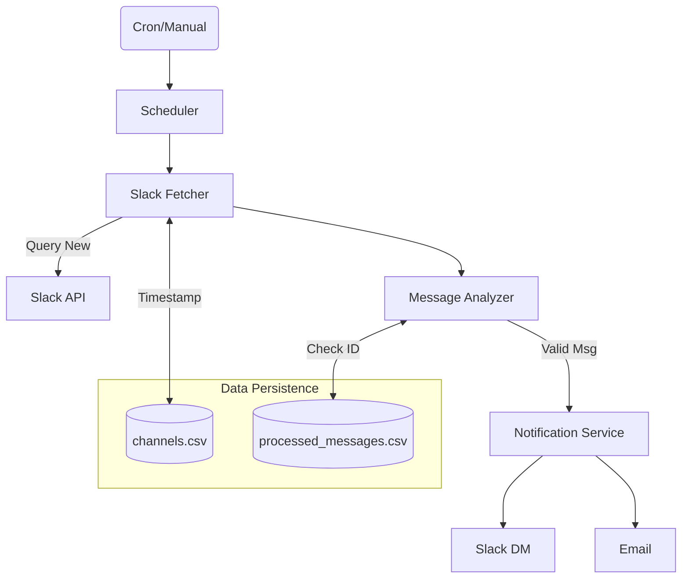

# 🤖 Slack Control Agent & Proactive Monitor

> A deterministic, production-ready Slack automation system powered by FastAPI, Groq (Llama 3), and the official Slack SDK, featuring a fully automated monitoring daemon.


## 📖 Overview

This project is twofold. First, it provides a high-performance backend for controlling a Slack workspace via natural language. Unlike traditional "agents" that loop and hallucinate, this system uses a **Deterministic Router** architecture. Second, it includes a robust **Proactive Monitoring System** that automatically tracks workspace activity.

1.  **Intent Parsing**: A single LLM call maps natural language to Structured JSON.
2.  **Deterministic Execution**: Python logic resolves Channel/User IDs via exact lookup.
3.  **Proactive Monitoring**: Automatically scans designated channels for important messages and sends multi-channel alerts (Slack DM + Email).

**Key Benefits:**
-   **Fast**: Actions take ~1 second.
-   **Safe**: 0% hallucination rate for IDs.
-   **Reliable**: Never miss an important message with the stateful, deduplicating monitor.

## ✨ Features

-   **Messaging**: Send DMs, post to channels, reply to threads.
-   **Channel Management**: Create, Rename, Archive, List.
-   **User Management**: Invite, Kick (Remove), List users.
-   **Reactions**: Add/Remove emojis (Smart mapping: `thumbs_up` -> `:+1:`).
-   **Files**: Upload files/snippets.
-   **Scheduling**: Schedule messages for future delivery.
-   **Activity Monitoring**: 
    -   Automatically tracks new messages in designated channels.
    -   Filters by keywords (e.g., "Urgent", "Help").
    -   Sends digest notifications via Slack DM and Email.

---

## 🏗 System Architecture & Workflow

The system is split into two primary paradigms: **The Control Agent** (inbound requests) and **The Activity Monitor** (outbound scanning).

### 1. Control Agent Architecture
The agent relies on a single-pass LLM to determine the proper action.

```ascii
+-------------+      +-------------+      +-----------------+
|   Slack     | ---> |   FastAPI   | ---> |  Intent Parser  |
|  (User)     |      |   Backend   |      |  (Groq LLM)     |
+-------------+      +-------------+      +--------+--------+
                                                   |
                                                   v
+-------------+      +-------------+      +-----------------+
|  Slack API  | <--- | Slack Router| <--- | Structured JSON |
|  (Cloud)    |      | (Python)    |      | (Intent/Params) |
+-------------+      +-------------+      +-----------------+
```

#### Request Lifecycle Workflow:
1. **Reception**: User query is received at `POST /chat`.
2. **Intent Classification**: Groq (`llama-3.1`) parses the intent (e.g., `send_message`) and parameters (schema-bound).
3. **Deterministic Routing**: The system checks Slack API for the EXACT resource ID (e.g., matching `#general` to `C123AB`). If not found, it fails gracefully. No hallucination.
4. **Execution**: The precise Slack SDK method is invoked.

### 2. Activity Monitor Architecture
The monitoring system acts as a background watchdog utilizing a linear **Fetch → Filter → Notify** pipeline. It tracks state via lightweight local CSV databases so it never double-reports a message.



-   **State (`channels.csv`)**: Bookmarks the exact timestamp of the last check per channel.
-   **Deduplication (`processed_messages.csv`)**: Even if times overlap, a Slack `message_ts` is never processed twice.
-   **Delivery**: Bundles found messages into a single cleanly formatted digest.

---

## 🚀 Getting Started

### 1. Clone & Setup Environments
```bash
git clone https://github.com/yourusername/slack-control-agent.git
cd slack-control-agent
python -m venv venv
```
Activate the environment:
-   **Windows**: `venv\Scripts\activate`
-   **Mac/Linux**: `source venv/bin/activate`

Install dependencies:
```bash
pip install -r requirements.txt
```

### 2. Configuration
Create a `.env` file (`cp .env.example .env`) and configure:
```ini
# Core Credentials
GROQ_API_KEY=gsk_...
SLACK_BOT_TOKEN=xoxb-...
LOG_LEVEL=INFO

# Monitoring Settings
MONITOR_CHANNELS=C0ABC123,C0DEF456   # Must be actual Channel IDs (e.g., C0123AB)
CHECK_INTERVAL_MINUTES=15             
NOTIFICATION_USER_ID=U0AE2SUBSAK      # The Slack Member ID to receive DMs
EMAIL_ENABLED=true                    
EMAIL_USERNAME=your_email@gmail.com   
EMAIL_PASSWORD=your_app_password      
EMAIL_RECIPIENT=alert@example.com     
```

### 3. Slack App Scopes
Your Slack App requires the following Bot Token Scopes: `channels:read, channels:manage, channels:history, groups:read, groups:history, im:read, im:history, im:write, users:read, chat:write, files:write, reactions:write`.

**Ensure you "Reinstall to Workspace" after applying changes to scopes**. The bot must also be invited (`/invite @BotName`) to any private channels you are monitoring.

---

## 🏃 Running the Application

### Option A: The Full Server (API + Automated Monitoring)
Run the full FastAPI server. This starts both the REST API for control commands and triggers the background scheduler that monitors channels.
```bash
uvicorn app.main:app --reload --port 9000
```

### Option B: Testing the Monitor Manually
If you want to instantly trigger the Slack message fetch/email logic without waiting for the scheduler:
1. Guarantee you've provided legitimate Slack channel IDs in `.env`.
2. Post a real message in that Slack channel containing a keyword (e.g., "Urgent meeting!").
3. Run the script:
   ```bash
   python manual_trigger.py
   ```
4. Verify results in Terminal, Slack DMs, and your Email inbox.

### Option C: CLI Chat Tool (Testing Control Agent)
Test NLP requests directly. Assuming the API server is running (Option A):
```bash
python cli_chat.py
```
*Example input: `send happy friday to #general`*

---

## 🚨 Troubleshooting

- **"Found 0 messages" during monitoring test**: Normal. The bot only reads messages posted *after* the last check timestamp. Post a brand new message and try again.
- **channel_not_found error**: You're using an improper Channel ID in `.env` (it starts with `C`, not `#`), or the bot isn't invited to the private channel.
- **Emails not arriving**: Ensure `EMAIL_ENABLED=true` and verify the App Password.
- **Agent hallucinates or fails to find channel**: The agent deterministically matches channel names to the active workspace. Ensure the channel name exists perfectly.

---

## 📁 Project Structure

```text
slack-control-agent/
├── app/
│   ├── main.py          # FastAPI Entry Point
│   ├── config.py        # Settings & Env handling
│   ├── monitor/         # The Automated Monitoring System (scheduler, fetcher, notifier)
│   └── intent_parser.py # LLM Logic (LangChain + Groq)
├── monitor_data/        # State databases (.csv records)
├── cli_chat.py          # Interactive CLI for testing agent requests
├── manual_trigger.py    # Instant testing script for the monitor
├── requirements.txt     # Dependencies
└── README.md            # Comprehensive documentation
```

## 📄 License
MIT License.
